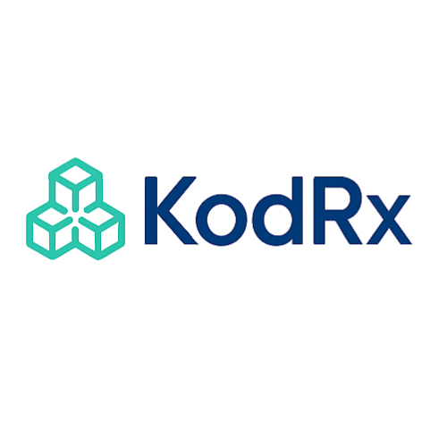

<p align="center">
  
</p>

<h1 align="center">KodRx</h1>

# KodRx

<p align="center">
  
</p>

<p align="center">
  <strong>Infraestructura digital para la trazabilidad de recetas médicas</strong>
</p>

<p align="center">
  Plataforma de emisión, validación y seguimiento operativo de recetas médicas digitales,
  diseñada para médicos, farmacias e instituciones de salud.
</p>

---

#  Descripción

KodRx es una plataforma enfocada en la digitalización y trazabilidad operativa de recetas médicas.

El sistema permite a médicos emitir recetas digitales verificables mediante QR, mientras que las farmacias pueden validar, registrar surtidos parciales o completos y mantener un historial verificable de dispensación.

KodRx incorpora mecanismos de autenticidad y trazabilidad basados en:

* Verificación mediante QR
* Identificadores únicos de receta
* Registro de surtido farmacéutico
* Historial de dispensación
* Estructura de sellado tipo blockchain
* Validación cruzada entre actores del ecosistema

La plataforma está diseñada para evolucionar hacia esquemas de interoperabilidad sanitaria y modelos institucionales de validación operativa.

---

# Funcionalidades principales

##  Módulo médico

* Emisión de recetas médicas digitales
* Generación automática de QR verificable
* Generación de PDF listo para impresión
* Historial de recetas emitidas
* Vista pública y privada de recetas
* Integración de indicaciones médicas
* Firma lógica mediante hash y bloque

---

##  Módulo farmacia

* Escaneo de recetas mediante cámara
* Lectura de QR desde navegador
* Validación operativa de recetas
* Registro de surtido total o parcial
* Bloqueo automático de medicamentos ya surtidos
* Historial de dispensación por farmacia
* Trazabilidad de quién surtió cada medicamento

---

##  Seguridad y trazabilidad

* Identificadores únicos por receta
* Hash de verificación
* Registro tipo blockchain
* Separación de vistas públicas y privadas
* Restricción de acceso por roles
* Validación de médicos y farmacias
* Control de cuentas suspendidas

---

##  Vista pública

Las recetas cuentan con una vista pública diseñada para:

* Verificar autenticidad
* Validar estado de la receta
* Consultar medicamentos e indicaciones
* Revisar sellado blockchain

La vista pública excluye datos clínicos sensibles.

---

#  Arquitectura del sistema

## Frontend

* HTML5
* CSS3
* JavaScript Vanilla

## Backend / Infraestructura

* Firebase Authentication
* Firebase Firestore
* Firebase Hosting / Vercel
* DigitalOcean (servicios auxiliares)

## Generación documental

* jsPDF
* html2canvas
* Generación dinámica de PDFs

## Verificación

* QR Codes
* Hashing estructurado
* Verificación blockchain-style

---

#  Roles del sistema

KodRx cuenta actualmente con los siguientes roles:

| Rol           | Función                      |
| ------------- | ---------------------------- |
| Médico        | Emisión de recetas           |
| Farmacia      | Validación y surtido         |
| Administrador | Gestión y validación         |
| Público       | Consulta pública verificable |

---

#  Flujo operativo

```text
Médico emite receta
        ↓
KodRx genera QR + ID + hash
        ↓
Paciente presenta receta
        ↓
Farmacia escanea QR
        ↓
Validación operativa
        ↓
Registro de surtido total/parcial
        ↓
Historial y trazabilidad
```

---

#  Roadmap

Las siguientes funcionalidades forman parte del roadmap de evolución de KodRx:

* Interoperabilidad sanitaria
* Integración con estándares clínicos
* Integración institucional
* Dashboard analítico para laboratorios
* Diagnóstico asistido con IA
* Integración avanzada de validación farmacéutica
* Evolución de trazabilidad blockchain

---

#  Consideraciones regulatorias

KodRx está diseñado como una plataforma de trazabilidad y operación digital complementaria.

La plataforma no sustituye mecanismos regulatorios oficiales ni sistemas institucionales de validación sanitaria.

El objetivo de KodRx es facilitar:

* trazabilidad operativa,
* control de surtido,
* verificación digital,
* y continuidad de información dentro del flujo médico-farmacia.

---

#  Estructura del proyecto

```text
/admin
/api
/assets
/componentes
/estilos
/farmacia
/laboratorio
/medico
/vendor
```

---

#  Estado del proyecto

KodRx se encuentra en etapa funcional avanzada.

Actualmente cuenta con:

* emisión de recetas operativa,
* validación farmacéutica,
* trazabilidad de surtido,
* generación PDF,
* verificación pública,
* y arquitectura modular en crecimiento.

---

# Licencia

Proyecto privado en desarrollo.

Todos los derechos reservados.

KodRx® es una marca registrada.

---

<p align="center">
  Desarrollado por el equipo fundador de <strong>KodRx</strong>
</p>
